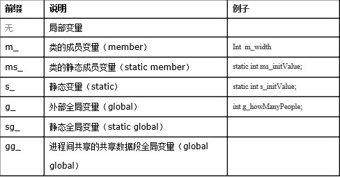
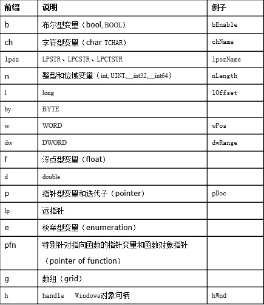

# C++代码命名规则：
## 第一部分：共性规则
共有八项。作为指导供成员采纳。
### 【规则1】标识符应简单明了，望文知意。
标识符采用英文单词。切忌使用汉语拼音来命名。程序中的英文单词一般不要太复杂，用词应当准确。例如不要把CurrentValue写成NowValue。
尽量不要使用单词缩写或首字母缩写。只有当标识符过长时才考虑使用单词缩写。在使用缩写时，不要自创缩写，尽量使用被广泛接受的缩写。
### 【规则2】标识符长度应当符合“min-length && max-information”原则。
一般的讲，长名字能更好地表达含义，所以函数名、变量名、类名长达十几个字符不足为怪。但是名字也不是越长越好。例如：变量名maxval就比maxValueUntilOverflow更好用。单字符的名字也是有用的，常见的如i,j,k,m,n,x,y,z等，它们通常用作函数内的局部变量。
### 【规则3】命名规则尽量与所采用的操作系统或开发工具的风格保持一致。
例如Windows应用程序的标识符通常采用“大小写”混排的方式，如AddChild。而Unix应用程序的标识符通常采用“小写加下划线”的方式，如add_child。别把这两类风格混在一起用。
### 【规则4】程序中不要出现仅靠大小写区分的标识符。
例如：int x和int X；void foo() 和void FOO() 等。
### 【规则5】避免在不同级别的作用域中重名。
程序中不要出现标识符完全相同的局部变量和全局变量，尽管两者因作用域的不同而不会发生语法错误，但会使人产生误解。
### 【规则6】正确命名具有互斥意义的标识符。
使用正确的反义词组命名具有互斥意义的变量或相反动作的函数。
如："MinValue"和"MaxValue"，"GetName()" 和 "SetName()" 
### 【规则7】尽量避免名字中出现数字编号。
如Value1,Value2等，除非逻辑上的确需要编号。这是为了防止程序产生无意义的名字，降低程序的可读性。
### 【规则8】使用库标志
在开发动态库时，为了防止软件库中的一些标识符和其它软件库中标识符冲突，可以为各种标识符加上能反映软件性质的前缀。
例如三维图形标准OpenGL的所有库函数均以gl开头，所有常量（或宏定义）均以GL开头。
## 第二部分：细则
我采用了一部分的“匈牙利”法命名规范，但没有照搬。“匈牙利”法最大的特征就是类型前缀。例如：
```
int nNum = 0; // n 为类型信息，表明 nNum 是一个 int 类型
class CUser; // C 为类型信息，表明 CUser 是一个类
```
但是正因为如此，“匈牙利”法命名规范也给人一种繁琐的感觉。例如：
```
int i, j, k; 
float x, y, z;
```
倘若采用“匈牙利”命名规则，则应当写成：
int iI, iJ, ik; // 前缀 i表示int类型
float fX, fY, fZ; // 前缀 f表示float类型
对于此类情况，我的处理方式是不加类型前缀。而对于下列情况我会加：
```
int iHeigh;
Bool bFlag;
```
总之，在我的命名规范中，类型前缀是一个可选的命名规则。下面分类进行详细的规范。
### 一、 类和接口
1、 命名：类名都以大写字母“C”开头，后跟一个或多个单词。每个单词的首字母要大写。接口以大写"I"开头，代表Interface。
2、 组成形式：推荐用"名词"或"形容词＋名词"的形式，例如："CAnalyzer", "CFastVector" ....
### 二、 函数
1、 命名：函数的名称由一个或多个单词组成。每个单词的首字母要大写。最长不得超过20个字符。        
2、 组成形式：全局函数应当使用"动词"或者"动词＋名词"（动宾词组）的形式。例如："gGetName()", " gDrawBox()"。
类成员函数应当只使用“动词”，被省略掉的名词就是对象本身。例如：
" box->Draw();"。       
3、 全局函数：以小写前缀"g"开头。       
4、 保护（protected）成员函数：开头应当加上一个下划线“_”以示区别，例如："_SetState()"        
5、 私有（private）成员函数：开头应当加上两个下划线“__”，例如："__DestroyImp()"    
6、 虚函数：习惯以“Do”开头，如："DoRefresh()", "_DoEncryption()"        
7、 回调和事件处理函数 ：习惯以单词“On”开头。例如："_OnTimer()", "OnExit()"     

### 三、 变量
变量是程序中使用最多的标识符，变量的命名规范是一套C++命名规范中最重要的部分：
1、 命名：变量名由作用域前缀＋类型前缀＋一个或多个单词组成。变量用小写字母开头的单词组合而成，第二个单词的首字母要大写。例如：int nDrawMode。变量最长不得超过20个字符。
特殊的：对于某些用途简单明了的局部变量，也可以使用简化的方式，如：i, j, k, x, y, z      
2、 组成形式：变量的名字应当使用"名词"或者"形容词＋名词"。例如："nCode", "m_nState"，"nMaxWidth"，" oldValue "，" newValue "。  
3、 作用域前缀：作用域前缀标明一个变量的可见范围。作用域可以有如下几种：        



说明：作用域前缀不同于下面的类型前缀，应该坚决执行。原因是：    
1）变量作用域和链接性改变的情况是很少的，例如，很少的情况下会把一个成员变量改成静态变量         
2）编程中使用的工具常常不会直观的显示变量的作用域和链接性       
4、 类型前缀：作用域前缀标明一个变量的可见范围。类型前缀标明一个变量的类型，有如下几种：



### 四、 常量
常量名由类型前缀＋全大写字母组成，单词间通过下划线来界定，如：cDELIMITER, nMAX_BUFFER。类型前缀的定义与变量命名规则中的相同。   
### 五、 结构体、宏、枚举变量、联合体
全部由前缀+大写字母组成，单词间使用下划线界定。         
1、 结构体：加小写前缀"tag"，之后以大写字母开头。
例：
```
typedef struct tagPOINT
{
int x;
int y;
} POINT;
```
2、 宏：大写字母组成，单词间使用下划线界定。例：
```
#define MAXNUMBER 100
```
3、 枚举变量：加小写前缀"enum"。例：
```
typedef enum _FILE_OPEN_MODE
{
OPEN_READONLY，
OPEN_READWRITE
}FILE_OPEN_MODE;
```
4、 联合体：加小写前缀"uni"。
例：
```
typedef union _VARIANT
{
char unichVal;
int uninVal;
float uniftVal;
} VARIANT;
```